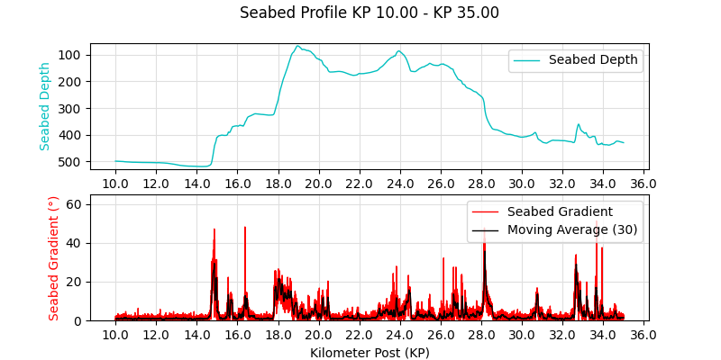

# Profiler-Plotter

**Profiler-Plotter** is a lightweight desktop application for visualizing seabed survey profiles. Built with Python and Tkinter, it lets users load CSV files containing kilometer post (KP) and depth data, compute seabed gradients, and plot depth profiles interactively. You can view plots within the app or export them to image files for reporting and analysis.

---

## Features

- Load route profile data from CSV
- Automatically compute:
  - Seabed gradient (°)
  - Moving average of gradient (30 points)
- Smart interval suggestion for x-axis (KP)
- Visualize depth and gradient in a clean 2-panel plot
- Export plot to PNG, JPG, PDF, or SVG
- GUI built with Tkinter (no command-line needed)

---

## Sample Output

Example:

- **Top panel**: Seabed depth vs. KP  
- **Bottom panel**: Seabed gradient and moving average

---

## Getting Started

### Requirements

- Python 3.7+
- Libraries:
  - `pandas`
  - `numpy`
  - `matplotlib`
  - `tkinter` (usually bundled with Python)

### Installation

Clone the repository:

```bash
git clone https://github.com/kingsley-ezenwaka/profiler-plotter.git
cd profiler-plotter
```

Install required libraries:

```bash
pip install pandas numpy matplotlib
```

Run the application:

```bash
python profiler_plotter.py
```

---

## Input Format

The app expects an **ASCII file** (CSV, TXT, etc.) with 2 columns and no header, in the format:

```
<kp_1>,<depth_1>
<kp_2>,<depth_2>
...
```

Example:
```
0.000,10.4
0.050,12.1
0.100,13.8
```

---

## Project Structure

```
profiler-plotter/
├── profiler_plotter.py     # Main script with GUI and logic
├── example/                
  └── sample_data.csv       # Sample CSV for testing
  └── sample_plot.png       # Sample export
└── README.md
```

---

## License

MIT — free to use and modify.

---

## Acknowledgements

This tool was developed for processing and visualizing seabed survey data. Gradient calculation and plot structure inspired by common workflows in marine geophysics and offshore engineering.
